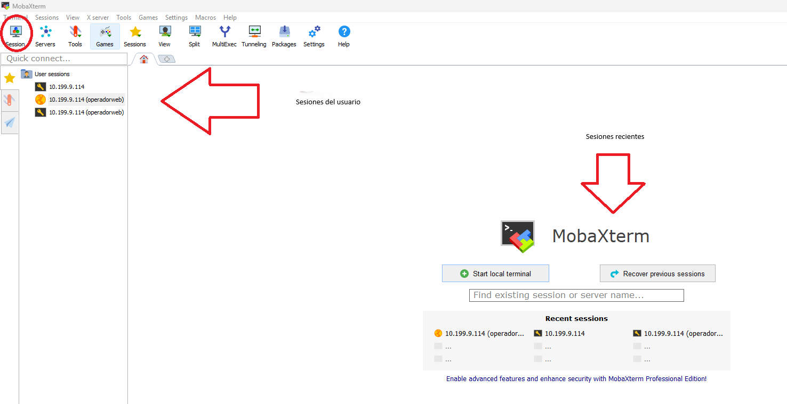

- [1.2 Windows 11](#12-windows-11)
      - [1.2.1 **Configuración inicial**](#121-configuración-inicial)
        - [**Nombre y configuración de red**](#nombre-y-configuración-de-red-1)
        - [**Cuentas administradoras**](#cuentas-administradoras-1)
      - [1.2.2 **Navegadores**](#122-navegadores)
      - [1.2.3 **MobaXTerm**](#123-MobaXTerm)
      - [1.2.4 **Netbeans**](#124-netbeans)

### 1.2 Windows 11
#### 1.2.1 **Configuración inicial**
##### **Nombre y configuración de red**
##### **Cuentas administradoras**
#### 1.2.2 **Navegadores**
#### 1.2.3 **MobaXTerm**
##### Conexion al servidor
Página de descarga 
```bash
https://mobaxterm.mobatek.net/download-home-edition.html
```
Para conectarnos a nuestro servidor, en la seccion de "Session"

|

Tanto para la conexion SSH como para la SFTP, solo debemos introducir la IP
del servidor y después el nombre de usuario (a recordar: operadorweb)
