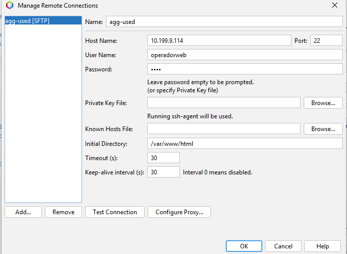

-[Volver](README.md)

- [1.1 **Windows 11**](#11-windows-11)
  
- [1.1.2 **Navegadores**](#112-navegadores)

- [1.1.3 **MobaXTerm**](#113-MobaXTerm)

-[1.1.3.1 Como subir archivos desde moba (SFTP)](#1131-como-subir-archivos-desde-moba-sftp)  

- [3.**Entorno de Explotación**](#3entorno-de-explotación)
    - [Apache NetBeans IDE22](#apache-netbeans-ide22)
      - [Para crear un nuevo proyecto](#para-crear-un-nuevo-proyecto)
      - [Conexion con base de datos](#conexion-con-base-de-datos)
      - [Como depurar un proyecto en NetBeans](#como-depurar-un-proyecto-en-netbeans)

## Windows 11

En nuestro caso, hemos usado una máquina host con un windows 11 para trabajar.

Si queremos comprobar que nuestro host y la maquina virtual tienen conexión, debemos abrir el CMD o "simbolo del sistema"

Una vez dentro, deberemos escribir el comando => ping ipMaquinaVirtual

|

Debemos hacer lo mismo desde la máquina virtual

Si no te sabes cuál es la ip del host, el comando para comprobarlo es "ipconfig"

### 1.1.2 Navegadores

El navegador que quieras usar es indiferente. Puedes usar el que más gustes

Si queremos abrir nuestra web almacenada en el servidor desde la web, deberemos de escribir la ip del servidor

|

### 1.1.3 MobaXTerm

Página de descarga 
```bash
https://mobaxterm.mobatek.net/download-home-edition.html
```
Para conectarnos a nuestro servidor, en la seccion de "Session"

|

Tanto para la conexion SSH como para la SFTP, solo debemos introducir la IP
del servidor y después el nombre de usuario (a recordar: operadorweb) con su contraseña (a recordar: paso)

#### 1.1.3.1 Como subir archivos desde moba (SFTP)

Lo primero que debemos hacer es conectarnos, desde SFTP, a la sesion adecuada.
Una vez dentro de la sesion con SFTP, distinguiremos dos apartados. Los archivos del Host (izquierda), y los que tiene el servidor al que nos hemos conectado(derecha)

|

Lo unico que deberemos hacer es colocarnos en la carpeta correcta del servidor, y subir los archivos/carpeta del host arrastrando desde la columna de la izquierda, o utilizando el boton de subir archivos

|

## 3.Entorno de Explotación
### Apache NetBeans IDE22
La página de descarga de nuestro NetBeans, en la version que usamos.
```bash
https://netbeans.apache.org/front/main/download/nb22/
```
#### Para crear un nuevo proyecto 
Es importante tener la carpeta creada con un archivo (aunque esté vacío) en nuestro servidor. Importante que el nombre de la carpeta sea el correcto. También es aconsejable tener la carpeta ya creada en local, sin necesidad de archivos dentro y con el nombre correspondiente.
Cuando creamos un nuevo proyecto elegimos
```bash
PHP application from Remote Server
```
Lo único que cambiamos en la primera pestaña es el nombre del proyecto, escribiendo el adecuado (el mismo que el de las carpetas)
En la siguiente pestaña:

|

En "manage":

|

Si se han realizado los pasos correctamente, ya deberiamos de haber creado nuestro primer proyecto.

#### Conexion con base de datos

Para poder conectarnos a nuestras bases de datos desde netbeans, hemos de ir a la pestaña de "Services"

En el apartado "Databases" hacemos click derecho encima, y seleccionamos "new connection"

Nos pedira un driver, he aquí el usado por un servidor: (https://mariadb.com/docs/connectors/mariadb-connector-j/about-mariadb-connector-j)

|

Ahora debemos de rellenar el fomrulario con el host donde se encuentra la base de datos, el nombre de la base de datos, el administrador de la base de datos y su contraseña

(Nota: es posible que uses "host:localhost" si la base de datos esta en tu propio dispositivo)

Puedes probar la conexión antes de confirmar con el botón "Test connection"

|

Una vez que la conexión es correcta, encontraremos nuestra conexión con la base de datos en el desplegable de "databases"

Para conectarnos, doble click en nuestra conexión, donde nos pedira el password

|

Finalmente, para ejecutar scripts (en un archivo .sql), debemos elegir nuestra conexión en el apartado connection (arriba de la página), y para ejecutarlo, clickar el botón señalado

|

##### Como depurar un proyecto en netbeans

Es importante para poder depurar en NetBeans que la configuracion del proyecto este correctamente. Un ejemplo:

|

Para comprobar que funciona, simplemente hacemos click derecho sobre el proyecto, y luego le damos a debug.

Si funciona, se abrirá un navegador y esperará a las ordenes del IDE. El IDE se colocará en la primera instrucción de todas.

|

En la barra de tareas de arriba habrá 6 opciones relacionadas con el debug. (Sino te aparecen, en el apartado View arriba a la izquierda, en el subapartado toolbars, elegir la opción debug).

Explicacion de los diferentes botones:


El boton cuadrado finaliza la sesion de debug
El boton de play, la aplicacion se ejecuta hasta que no tenga más instrucciones. Si pasa por algun punto de parada, se para ahí.
El primer botón  con una flecha naranja , salta a la siguiente instruccion. Si la instruccion llama a otro archivo, no te envia a ese archivo, se ejecuta entero directamente y pasa a la siguiente instruccion. Lo mismo con las funciones (step over)
El segundo botón  con una flecha naranja , salta a la siguiente instruccion. Si la instruccion llama a otro archivo, SI te envia a ese archivo, se ejecuta intruccion a instruccion. Ejecuta TODAS las instrucciones por donde a pasado. Lo mismo con las funciones (step into)
El tercer botón  con una flecha naranja, si estas dentro de una funcion o un archivo, con este boton te lo saltas y pasa al siguenten bloque (step over)
El cuarto botón  con una flecha naranja, sirve para que se ejecute hasta donde tengas en cursor colocado.
