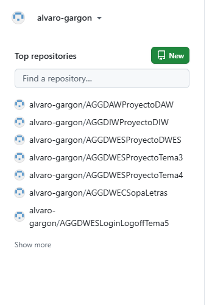
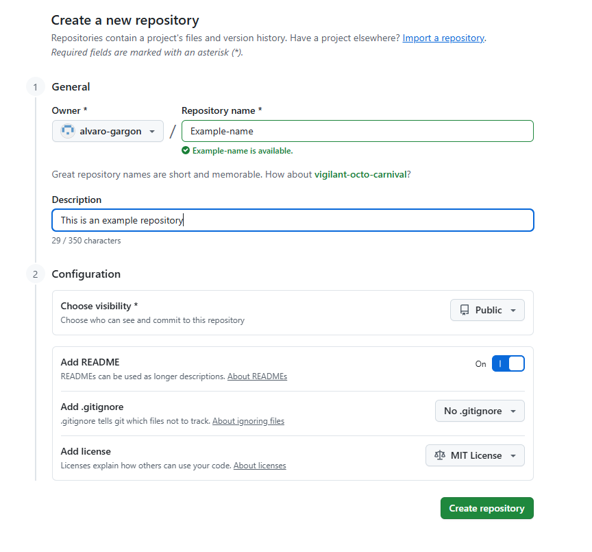
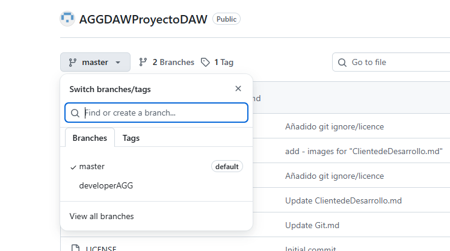
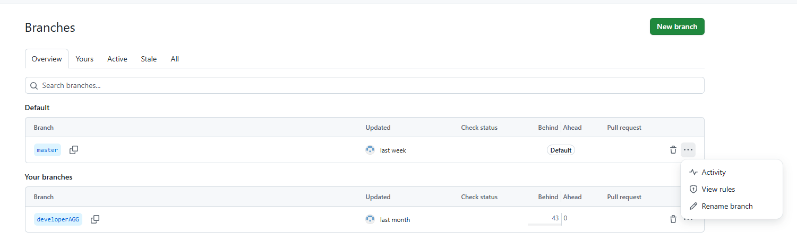
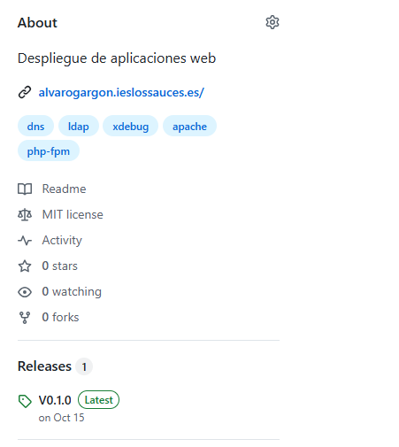
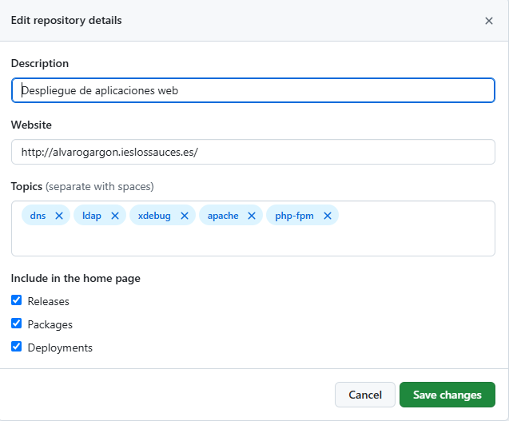
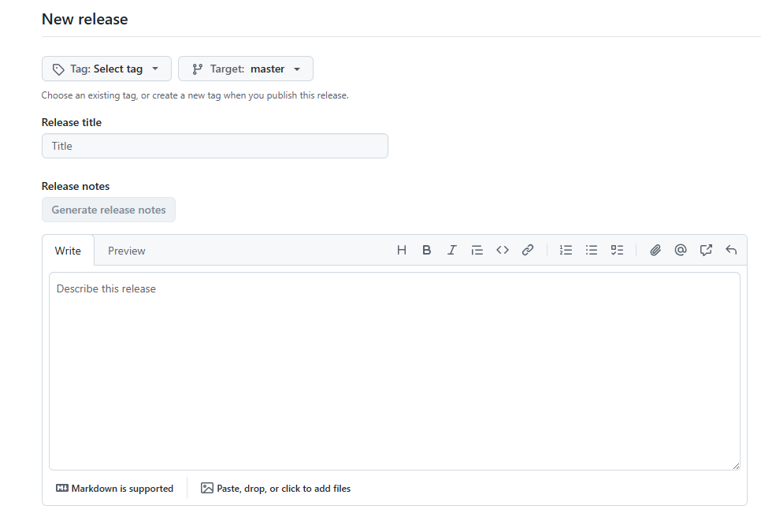

-[Volver](README.md)
#Git y Github

Como en este ciclo usamos el IDE para hacer todas las acciones que necesitemos con nuestro repositorio, dirigirse al archivo de Cliente de Desarrollo para comprobar su uso

## Github
### Creacion de un repositorio

|

Al entrar en la página principal de github trás iniciar sesión, veremos a la izquierda nuestros repositorios. Y encima de ellos la opción de crear un nuevo repositorio.

|

Dentro de la siguiente pestaña solo tendremos que ponerle un nombre al repositorio y , aconsejablemente, una descripción. En nuestro ciclo, siempre añadiremos un README y una licencia MIT

### Creacion y renombramiento de una rama
Si quisieramos crear ramas o renombrarlas en un repositorio que ya tenemos, solo debemos de clickar encima del nombre de la rama (nombre por defecto: main) y después la opción "View all branches"ç
Nota: en la imagen, la rama se llamará master y no main, puesto a que ya le he cambiado el nombre

|

Una vez dentro, podemos cambiar el nombre de una rama, en la opción de los tres puntos: rename branch
También podemos crear una rama nueva con el botón verde de arriba a la izquierda, usando como rama de origen otra ya creada, ya sea la de por defecto u otra hecha por nosotros anteriormente
Nota: Si le cambias el nombre a una rama y después deseas crear una nueva rama teniendo como base la rama recien cambiada de nombre, antes de empezar el proceso de creación de la rama actualiza la página. Es para asegurarnos de que el nombre de la rama se ha cambiado correctamente y se ha guardado. Si se ignora esto podría tener problemas al crear la rama

|

### About

|

Debemos añadir información adicional sobre nuestro repositorio, ya una descripción, nuestra web, o etiquetas que hablan de nuestro repositiorio

|

### Releases

Ya sabemos que para subir contenido a nuestro entorno de explotación debemos crear primero una release. Para crear una, en la página principal, debajo de about, clickaremos en Releases

|

(Si no es nuestra primera release, darle a "draft new release")

|

Es muy fácil crear una release, solo debemos de crear una nueva TAG y en el title ponerle el mismo nombre que el de la TAG

Nomenclatura: Vx.x.x . 
El primer numero solo se usa, el 0 si la aplicación no ha sido publicada y esta en desarrollo, o 1 si ya ha sido lanzada.
El segundo numero es cuando el código recibe cambios importanes
El tercer numero es para el resto de cambios
Ejemplo de una aplicación que ya ha salido: V1.10.17

Volviendo a nuestra release, si queremos le añadiremos una descripción, y ya estaría listo. Solo debemos darle a "Publish release"
