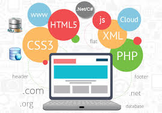

# CFGS Desarrollo de Aplicaciones Web

|  CFGS DESARROLLO  DE APLICACIONES WEB |
|:-----------:|
||
| DESPLIEGUE DE APLCIACIONES WEB
| DAWES Tema 2. INSTALACIÓN, CONFIGURACIÓN Y DOCUMENTACIÓN DE ENTORNO DE DESARROLLO Y DEL ENTORNO DE EXPLOTACIÓN |

-[Servidor de desarrollo](ServidordeDesarrollo.md)

-[Cliente de desarrollo](ClientedeDesarrollo.md)

-[Git y GitHub](Git.md)

-[Entorno de explotación](entornoExplotacion.md)

---

> **Álvaro García González**  
> Curso: 2025/2026  
> 2º Curso CFGS Desarrollo de Aplicaciones Web  

