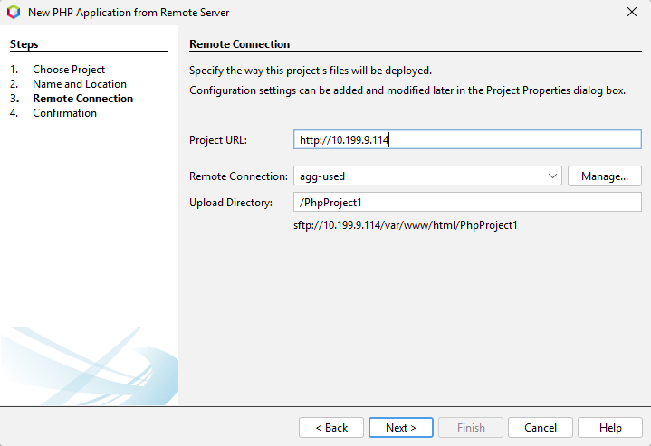
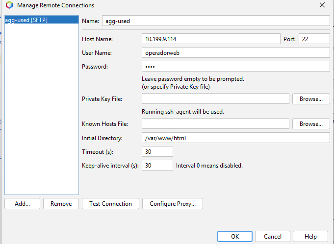
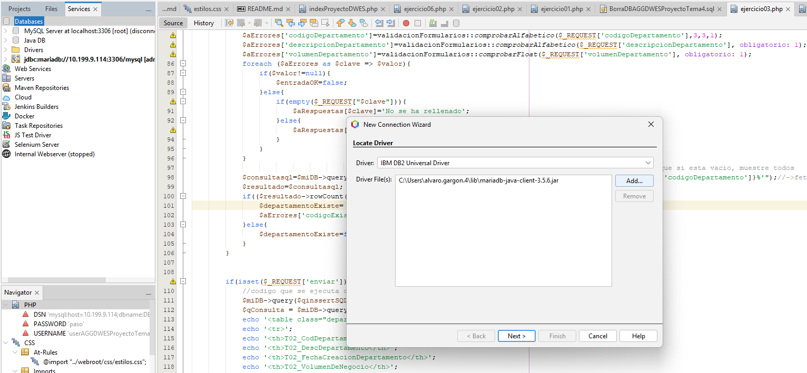
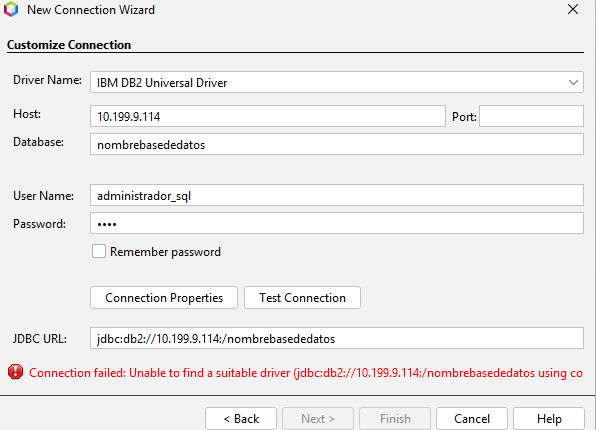
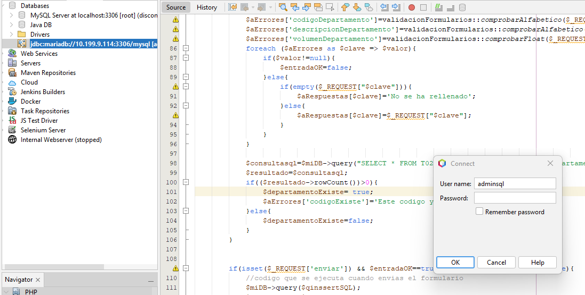
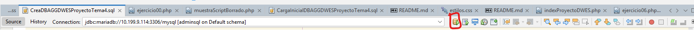

-[Volver](README.md)
- [3.Entorno de Explotación](#3entorno-de-explotación)
    - [Apache NetBeans IDE22](#apache-netbeans-ide22)
      - [Para crear un nuevo proyecto](#para-crear-un-nuevo-proyecto)
      - [Conexion con base de datos](#conexion-con-base-de-datos)
        
## 3.Entorno de Explotación
### Apache NetBeans IDE22
La página de descarga de nuestro NetBeans, en la version que usamos.
```bash
https://netbeans.apache.org/front/main/download/nb22/
```
#### Para crear un nuevo proyecto 
Es importante tener la carpeta creada con un archivo (aunque esté vacío) en nuestro servidor. Importante que el nombre de la carpeta sea el correcto. También es aconsejable tener la carpeta ya creada en local, sin necesidad de archivos dentro y con el nombre correspondiente.
Cuando creamos un nuevo proyecto elegimos
```bash
PHP application from Remote Server
```
Lo único que cambiamos en la primera pestaña es el nombre del proyecto, escribiendo el adecuado (el mismo que el de las carpetas)
En la siguiente pestaña:

|

En "manage":

|

Si se han realizado los pasos correctamente, ya deberiamos de haber creado nuestro primer proyecto.

#### Conexion con base de datos

Para poder conectarnos a nuestras bases de datos desde netbeans, hemos de ir a la pestaña de "Services"

En el apartado "Databases" hacemos click derecho encima, y seleccionamos "new connection"

Nos pedira un driver, he aquí el usado por un servidor: (https://mariadb.com/docs/connectors/mariadb-connector-j/about-mariadb-connector-j)

|

Ahora debemos de rellenar el fomrulario con el host donde se encuentra la base de datos, el nombre de la base de datos, el administrador de la base de datos y su contraseña

(Nota: es posible que uses "host:localhost" si la base de datos esta en tu propio dispositivo)

Puedes probar la conexión antes de confirmar con el botón "Test connection"

|

Una vez que la conexión es correcta, encontraremos nuestra conexión con la base de datos en el desplegable de "databases"

Para conectarnos, doble click en nuestra conexión, donde nos pedira el password

|

Finalmente, para ejecutar scripts (en un archivo .sql), debemos elegir nuestra conexión en el apartado connection (arriba de la página), y para ejecutarlo, clickar el botón señalado

|
