-[Volver](README.md)

-[Acceso](#acceso)

-[Subir archivos](#subir-archivos)

-[Creacion e Importacion de una base de datos](#creacion-e-Importacion-de-una-base-de-datos)

-[Creacion](##creacion)

-[Importacion](#importacion)

-[Porque usar phpMyAdmin](###porque-usar-phpmyadmin)

-[Como añadir el certificado https](##como-añadir-el-certidficado-https)

-[Como hacer el paso a explotacion de un proyecto AMP](https://alvarogargon.ieslossauces.es/AGGCIBProyectoCIB/doc/pasoProduccionAExplotacion.pdf)

Documentación sobre como configurar tu entorno de explotación nivel usuario (no administrador) mediante un hosting. En este caso, usaremos el hosting IONOS con su software PLESK

# Acceso
En el navegador deberas introducir: https://<your domain name or the server IP address>:8443
Esto dara paso una un login donde deberás introducir tu usario y contraseña

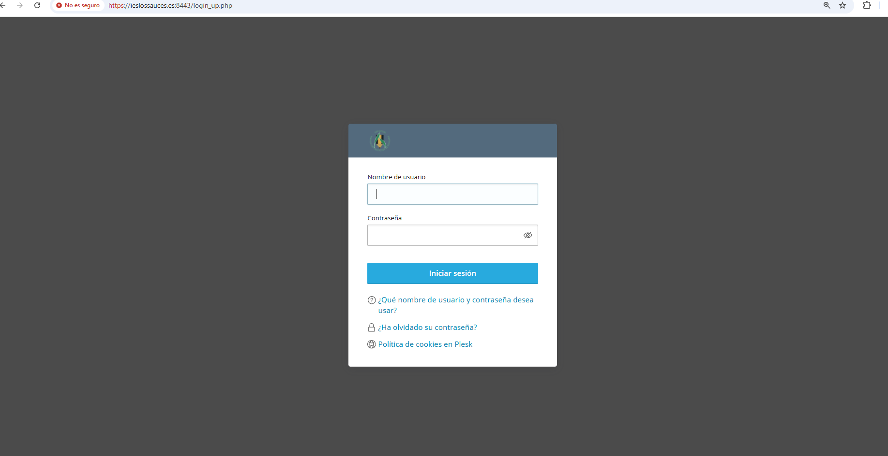|

# Subdominios
Es muy probables que necesites el uso de subdominios, ya que te permiten tener webs distintas en el mismo servidor
El proceso de creacion es relativamente sencillo
En la primera página nada más entrar (que es el apartado de sitios webs y dominios)

|

Posteriormente nos pedira que le pongamos nombre y la raiz del documento.
RECOMENDACION: usa el mismo nombre en ambos
En la raiz es importante que este dentro de la carpeta httpdocs/
Foto de ejemplo:

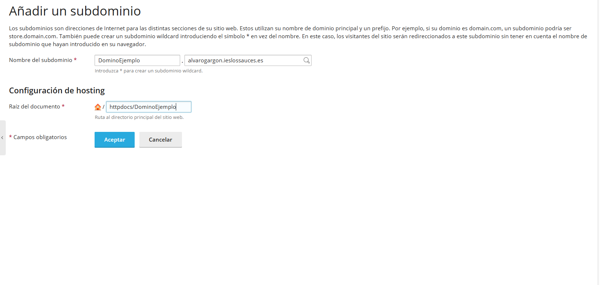|

#Subir archivos
Aunque es posible, **no es aconsejable subir archivos desde la propia pagina de plesk**
Para subir archivos, usar alguna herramienta que te permita subir los archivos a traves de SFTP (como hacerlo con [MobaXterm](https://alvarogargon.ieslossauces.es/AGGCIBProyectoCIB/doc/pasoProduccionAExplotacion.pdf) por ejemplo)

# Creacion e Importacion de una base de datos

## Creacion

Ahora queremos crear una base de datos. En el panel lateral izquierdo, nos dirigiremos al apartado bases de datos.
Ahi simplemente le daremos a "añadir base de datos"

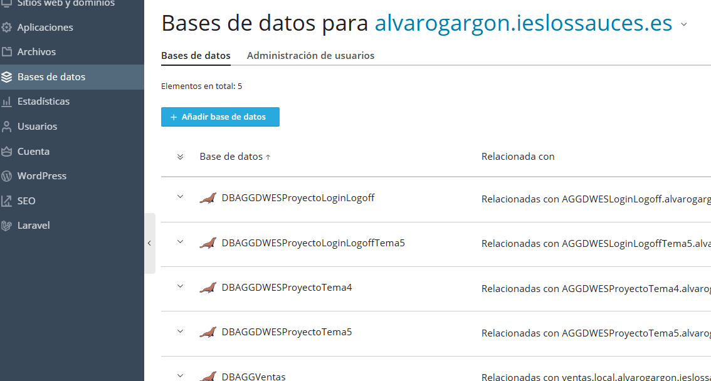|

Dentro, tendremos que elegir su nombre, si la queremos relacionar con algun subdmonio creado (Altamente recomendable).
También deberemos crear un usuario de la base de datos y su contraseña. **Importante recordar ambos**

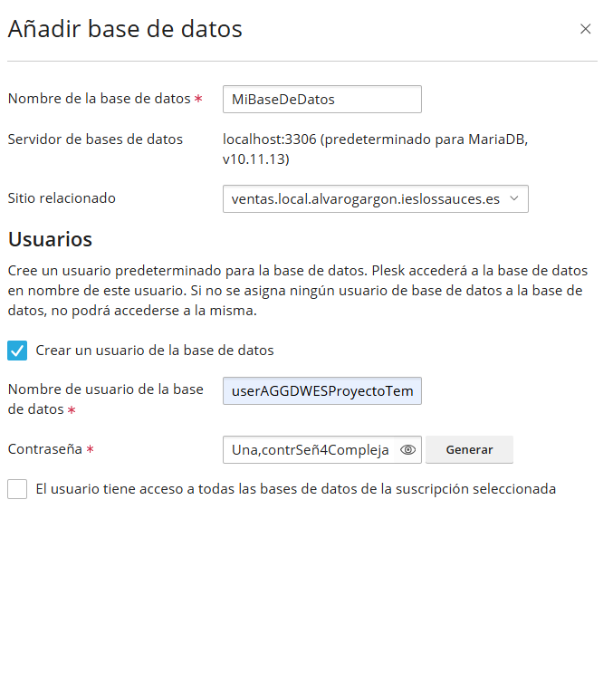|

## Importacion

Existen dos métodos para importar tu base de datos a la base de datos del hosting.
O importandola a traves de un archivo (puede dar problemas) o usar los scripts a través de phpMyAdmin.

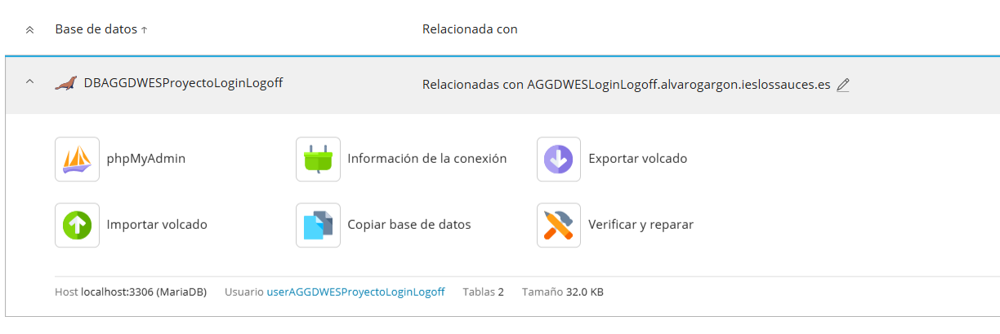|

El método "Importar volcado" es muy simple, solo deberemos elegir el archivo donde tenemos el script de creacion y carga incial.

El método a través de phpMyAdmin es ligeramente más complejo (aunque sigue siendo sencillo)
Clicamos en esa opcion, que nos abrirá una nueva pestaña. Nosotros queremos movernos a la ventana "SQL"
Allí deberemos pegar a mano los scripts de creación y carga inicial (si tienes comentarios, eliminalos, ya que te daran error)
Para confirmar, pulsaremos el botón de "Continuar"

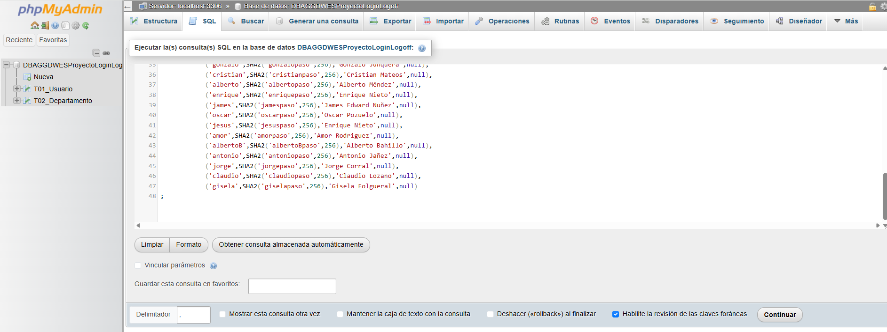|

### Porque usar phpMyAdmin

Lo usaremos porque, con el método del importado, es posible que nos de errores de permisos al usar nuestra aplicación.
Sin embargo, si usamos phpMyAdmin, **no** debería haber esos problemas.

## Como añadir el certificado https

Aunque ya tengamos el certificado https en el servidor, observaremos que al entrar en nuestra web, nos sigue poniendo que nuestra web no es segura (aunque tenga el prefijo https)
¿Como solucionar esto?

Lo primero que debemos de hacer es ir al apartado "Certificados SSL/TLS" en nuestro subdominio (Suponiendo que es la primera vez, hacerlo en el dominio principal si es que tenemos)

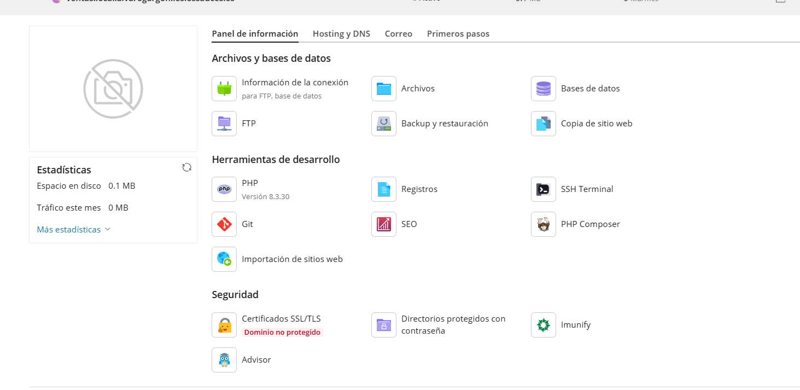|

En la parte de abajo de la página, eligiremos "Instalar un certificado básico gratuito de Let's Encrypt"

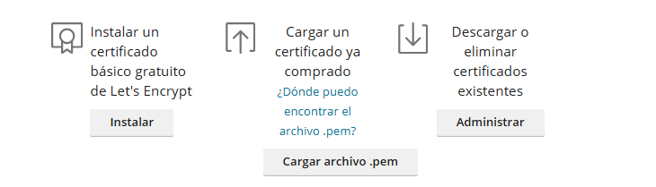|

Una vez allí, escribiremos nuestro correo y las opciones que deseemos

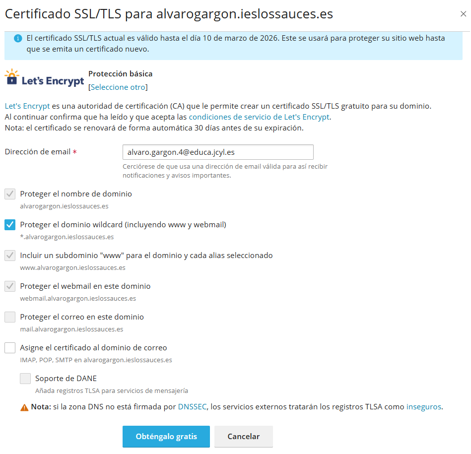|

Nos saltará un aviso para que hagamos el registro, debemos copiar el nombre del domino y el registro 

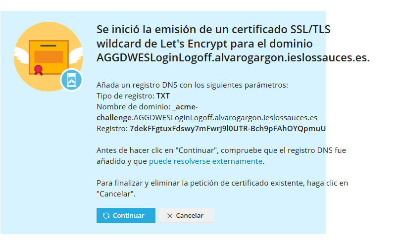|

¿Como añadir un registro?
Nos dirigimos a nuesto subdomino, en el apartado "Hosting y DNS" y clicamos en el icono de DNS

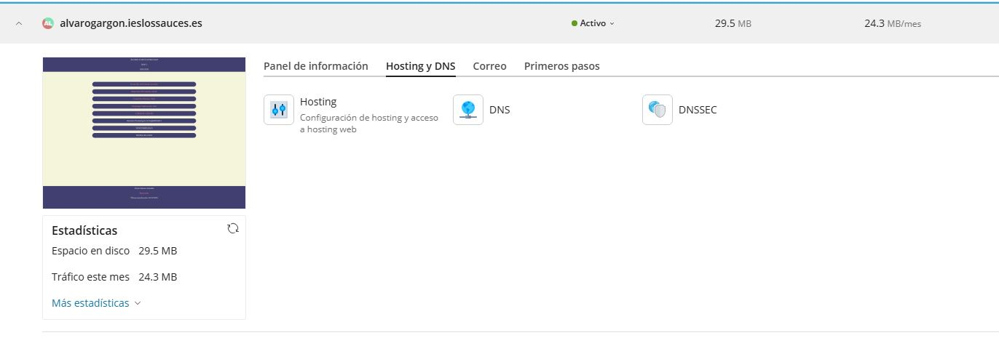|

Ahi le daremos a añadir registro, eligiremos del tipo TXT (nos lo dicen en la foto de hace 2 pasos) y rellenaremos con los datos que nos dieron hace 2 pasos (es decir el nombre del dominio y el registro TXT) 
